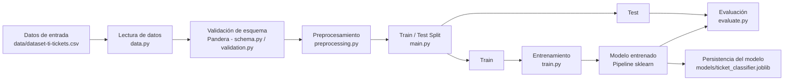

# Arquitectura del Pipeline de Machine Learning

> Nota: la plantilla de referencia de este documento menciona un caso de "Customer Churn",
> pero este repositorio implementa un **clasificador de tickets de soporte de TI**. El
> contenido de este documento refleja la implementación real del proyecto.

## 1. Objetivo

El proyecto implementa un pipeline de Machine Learning simple y reproducible cuyo objetivo
es clasificar automáticamente tickets de soporte de TI en la **cola de soporte (`queue`)**
a la que deben ser enrutados, a partir del texto del ticket (asunto y descripción).

El pipeline está pensado con fines académicos de aprendizaje de MLOps, priorizando
simplicidad y separación clara de responsabilidades por encima de sofisticación técnica.

## 2. Vista general de la arquitectura



El conjunto de **Test** solo participa en la rama de evaluación (`G --> J`): nunca se usa
para ajustar el modelo ni las transformaciones.

## 3. Flujo de datos

1. **Lectura de datos** (`data.py`)
   - Qué se hace: carga el archivo CSV desde la ruta configurada.
   - Qué recibe: una ruta de archivo (`DATA_FILE` en `config.py`).
   - Qué produce: un `pandas.DataFrame` crudo.
   - Por qué existe: aísla el acceso a la fuente de datos del resto del pipeline; si cambia
     el origen de los datos, solo se modifica este módulo.

2. **Validación de esquema** (`validation.py` + `schema.py`)
   - Qué se hace: valida el `DataFrame` contra un contrato de datos definido con Pandera.
   - Qué recibe: el `DataFrame` crudo.
   - Qué produce: el mismo `DataFrame` si es válido, o una excepción (`SchemaError`) con el
     detalle del incumplimiento.
   - Por qué existe: detecta problemas de datos (columnas faltantes, tipos incorrectos,
     categorías no permitidas) antes de que lleguen al resto del pipeline.

3. **Preprocesamiento** (`preprocessing.py`)
   - Qué se hace: combina las columnas de texto (`subject`, `body`) en una única serie de
     entrada y separa la variable objetivo (`queue`).
   - Qué recibe: el `DataFrame` validado.
   - Qué produce: `X` (texto de entrada) e `y` (variable objetivo).
   - Por qué existe: mantiene separada la responsabilidad de "dar forma a los datos para el
     modelo" de la responsabilidad de "validar que los datos cumplen el contrato".

4. **Train / Test Split** (`main.py`, usando `train_test_split` de scikit-learn)
   - Qué se hace: separa `X`/`y` en conjuntos de entrenamiento y test.
   - Qué recibe: `X`, `y` y los parámetros `TEST_SIZE`/`RANDOM_STATE` de `config.py`.
   - Qué produce: `X_train`, `X_test`, `y_train`, `y_test`.
   - Por qué existe: permite medir el desempeño del modelo sobre datos que no vio durante
     el entrenamiento, evitando una evaluación optimista.

5. **Entrenamiento** (`train.py`)
   - Qué se hace: construye el pipeline de scikit-learn (`TfidfVectorizer` +
     `LogisticRegression`) y lo ajusta (`fit`) únicamente con los datos de entrenamiento.
   - Qué recibe: `X_train`, `y_train`.
   - Qué produce: un pipeline entrenado (vectorizador + modelo).
   - Por qué existe: concentra la lógica de entrenamiento en un único punto, reutilizando la
     definición del pipeline de `preprocessing.py`.

6. **Evaluación** (`evaluate.py`)
   - Qué se hace: genera predicciones sobre `X_test` y calcula métricas de clasificación.
   - Qué recibe: el modelo entrenado, `X_test`, `y_test`.
   - Qué produce: un diccionario de métricas y una matriz de confusión impresa por consola.
   - Por qué existe: mide de forma objetiva el desempeño del modelo sobre datos no vistos.

7. **Persistencia** (`main.py`, usando `joblib`)
   - Qué se hace: guarda el pipeline entrenado (vectorizador + modelo) en disco.
   - Qué recibe: el modelo entrenado.
   - Qué produce: un archivo `.joblib` en `models/`.
   - Por qué existe: permite reutilizar el modelo entrenado sin necesidad de re-entrenarlo.

## 4. Componentes

| Componente | Responsabilidad | Entrada | Salida |
|---|---|---|---|
| `config.py` | Centralizar rutas, columnas, hiperparámetros y parámetros del split | Configuración del proyecto | Constantes (`DATA_FILE`, `MODEL_FILE`, `TARGET_COLUMN`, `TEST_SIZE`, `RANDOM_STATE`, `TFIDF_PARAMS`, `MODEL_PARAMS`, etc.) | 
| `data.py` (Data Reader) | Leer el dataset desde la fuente definida | Ruta del archivo CSV | `DataFrame` crudo |
| `schema.py` / `validation.py` (Schema) | Validar el contrato de datos con Pandera | `DataFrame` crudo | `DataFrame` validado (o excepción) |
| `preprocessing.py` (Preprocessing) | Construir el texto de entrada, separar `X`/`y` y definir el pipeline sklearn | `DataFrame` validado | `X`, `y` y el `Pipeline` (sin entrenar) |
| `main.py` (Train/Test Split) | Separar los datos procesados en entrenamiento y test | `X`, `y` | `X_train`, `X_test`, `y_train`, `y_test` |
| `train.py` (Training) | Entrenar el modelo usando solo datos de entrenamiento | `X_train`, `y_train` | Modelo entrenado (`Pipeline` ajustado) |
| `evaluate.py` (Evaluation) | Evaluar el modelo sobre el conjunto de test | Modelo + `X_test`, `y_test` | Métricas (accuracy, precision, recall, F1) y matriz de confusión |
| `main.py` (Persistence) | Guardar el modelo entrenado | Modelo entrenado | Artefacto `models/ticket_classifier.joblib` |

## 5. Contrato de datos

El contrato de datos se define en `schema.py` mediante `pandera.pandas.DataFrameSchema` y se
ejecuta a través de `validate_dataset()` en `validation.py`. Especifica, para cada columna
real del dataset:

- **Nombre de columna**: por ejemplo `body`, `queue`, `priority`, `version`.
- **Tipo de dato**: por ejemplo `body` y `queue` son `str`, `version` es `int`.
- **Columna obligatoria (no nula)**: `body`, `type`, `queue`, `priority`, `language`,
  `version` y `tag_1` están definidas con `nullable=False`.
- **Valores categóricos permitidos**: mediante `Check.isin(...)`, por ejemplo:
  - `type` solo admite `["Incident", "Request", "Problem", "Change"]`.
  - `priority` solo admite `["high", "medium", "low"]`.
  - `language` solo admite `["de", "en"]`.
  - `queue` solo admite las diez colas definidas en `ALLOWED_QUEUES`.
- **Restricciones básicas**: `version` debe ser mayor o igual a cero (`Check.ge(0)`).
- El esquema usa `strict=True`, por lo que rechaza columnas no declaradas en el contrato, y
  `coerce=False`, para dejar explícito que el contrato **solo valida, no transforma** datos.

Esta validación permite detectar datos corruptos o inesperados (tipos incorrectos, columnas
faltantes, categorías nuevas no contempladas) antes de que entren al resto del pipeline.

## 6. Configuración

`config.py` centraliza todos los valores que de otra forma estarían dispersos como "números
mágicos" en distintos archivos:

- Rutas del proyecto (`DATA_DIR`, `DATA_FILE`, `MODELS_DIR`, `MODEL_FILE`), construidas con
  `pathlib.Path`.
- Columnas relevantes (`TEXT_COLUMNS`, `TARGET_COLUMN`).
- Parámetros del split (`TEST_SIZE`, `RANDOM_STATE`).
- Hiperparámetros del baseline (`TFIDF_PARAMS`, `MODEL_PARAMS`).

Mantener esta configuración separada de la lógica del pipeline facilita cambiar, por
ejemplo, la variable objetivo o el tamaño del test sin tocar el código de entrenamiento o
evaluación, y evita inconsistencias entre módulos que de otro modo repetirían el mismo valor.

## 7. Prevención de Data Leakage

- **Separación Train/Test**: el split se realiza en `main.py` antes de cualquier
  entrenamiento, usando `train_test_split` con `stratify=y` para mantener la proporción de
  clases en ambos conjuntos.
- **Fit únicamente sobre Train**: el `Pipeline` (`TfidfVectorizer` + `LogisticRegression`)
  se ajusta (`fit`) exclusivamente con `X_train`/`y_train` dentro de `train_model()`.
- **Transform sobre Test**: al llamar `model.predict(X_test)` en `evaluate_model()`, el
  `TfidfVectorizer` ya ajustado solo transforma el texto de test, sin volver a aprender
  vocabulario ni estadísticas de ese conjunto.
- **Aislamiento del Test**: el conjunto de test no participa en ninguna decisión previa a la
  evaluación final; se usa una única vez, al final del flujo, dentro de `evaluate_model()`.

## 8. Reproducibilidad

El proyecto busca resultados reproducibles mediante:

- **`RANDOM_STATE`**: un único valor definido en `config.py` (`42`) que se reutiliza tanto en
  `train_test_split` como en `LogisticRegression`, evitando semillas distintas dispersas por
  el código.
- **Configuración centralizada**: los hiperparámetros y rutas viven en `config.py`, por lo
  que ejecutar el pipeline con la misma configuración produce el mismo resultado.
- **Versionado del código**: el repositorio Git permite rastrear qué versión del código y la
  configuración produjo un modelo determinado.
- **Estructura consistente del pipeline**: el flujo lectura → validación → preprocesamiento →
  split → entrenamiento → evaluación → persistencia se ejecuta siempre en el mismo orden
  desde `main.py`.

## 9. Estructura del proyecto

```
ti-support-ticket-classifier/
├── data/
│   └── dataset-ti-tickets.csv
├── models/
│   └── ticket_classifier.joblib
├── src/
│   ├── __init__.py
│   ├── config.py
│   ├── data.py
│   ├── schema.py
│   ├── validation.py
│   ├── preprocessing.py
│   ├── train.py
│   ├── evaluate.py
│   └── main.py
├── tests/
│   ├── test_schema.py
│   └── test_pipeline.py
├── .github/
│   └── workflows/ci.yml
├── requirements.txt
└── README.md
```

## 10. Decisiones de diseño

- **Separación de responsabilidades**: cada módulo (`data.py`, `schema.py`/`validation.py`,
  `preprocessing.py`, `train.py`, `evaluate.py`) tiene una única razón para cambiar. Esto
  facilita entender, probar y modificar cada etapa de forma independiente.
- **Validación temprana de datos**: el contrato de Pandera se ejecuta inmediatamente después
  de leer los datos, antes de cualquier transformación o entrenamiento, para fallar rápido y
  con un mensaje claro ante datos inválidos.
- **Configuración centralizada**: `config.py` evita valores hardcodeados repetidos y hace
  explícitos los parámetros que definen el comportamiento del pipeline.
- **Separación Train/Test**: se realiza antes de ajustar cualquier transformación, para que
  la evaluación refleje el desempeño sobre datos no vistos.
- **Prevención de Data Leakage**: el uso de un único `Pipeline` de scikit-learn asegura que
  el vectorizador se ajusta solo con Train y se aplica (sin reajustar) sobre Test.
- **Reproducibilidad**: uso consistente de `RANDOM_STATE` y configuración centralizada para
  que el pipeline sea determinista dado el mismo dataset y código.
- **Simplicidad del pipeline**: se eligió un modelo baseline (`TfidfVectorizer` +
  `LogisticRegression`), sin búsqueda de hiperparámetros ni herramientas adicionales
  (tracking de experimentos, orquestadores, etc.), priorizando que el flujo completo sea
  fácil de leer y entender.

## 11. Ejecución del pipeline

El pipeline completo se ejecuta con:

```powershell
python src/main.py
```

Esto ejecuta, en orden, todas las etapas descritas en la sección 3: lectura de datos,
validación de esquema, preprocesamiento, split train/test, entrenamiento, evaluación
(impresión de métricas y matriz de confusión por consola) y persistencia del modelo en
`models/ticket_classifier.joblib`.

Las dependencias del proyecto se instalan con:

```powershell
pip install -r requirements.txt
```

## 12. Extensibilidad

La arquitectura actual es intencionalmente simple, pero podría evolucionar hacia, por
ejemplo:

- **Nuevos modelos**: reemplazar o comparar `LogisticRegression` con otros clasificadores
  dentro del mismo `Pipeline` de `preprocessing.py`.
- **Nuevas fuentes de datos**: adaptar `data.py` para leer desde otras fuentes (bases de
  datos, APIs) sin modificar el resto del pipeline.
- **Feature Engineering más sofisticado**: incorporar otras columnas del dataset (por
  ejemplo `priority`, `language`) como features adicionales mediante `ColumnTransformer`.
- **Experiment Tracking**: registrar métricas y parámetros de cada ejecución con una
  herramienta de tracking de experimentos.
- **Model Registry**: versionar y gestionar los artefactos generados en `models/`.
- **CI/CD**: extender el workflow existente en `.github/workflows/ci.yml` para incluir
  entrenamiento o validación automática del modelo.
- **Orquestación**: coordinar la ejecución periódica del pipeline con un orquestador de
  workflows.

Estas capacidades son posibles evoluciones futuras; **ninguna de ellas forma parte de la
implementación actual del proyecto**.
